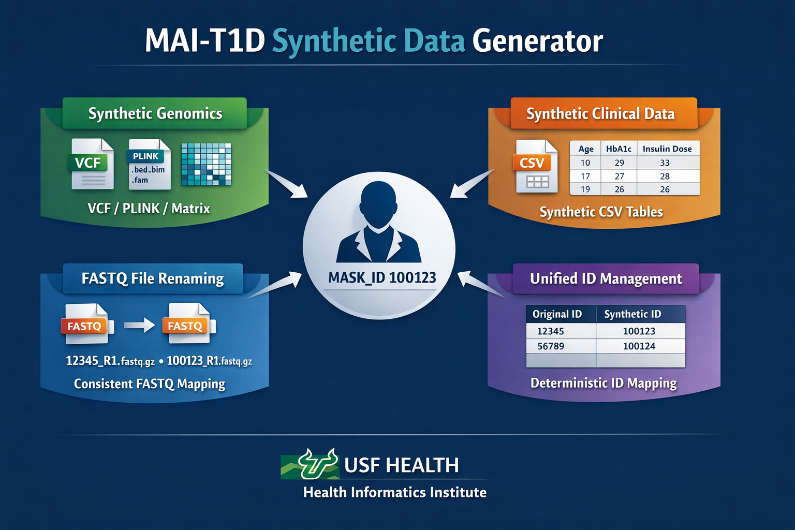

# MAI-T1D Synthetic Data Generator
#
# Authors:		Kenneth Young, PhD
#				Dena Tewey, MPH
#
# Affiliation:	University of South Florida (USF)
#				Morsani College of Medicine				
#				Health Informatics Institute

---
## Overview

This repository contains the synthetic data generation pipeline developed for
the MAI-T1D project using data from the TEDDY (The Environmental Determinants of
Diabetes in the Young) study.

The pipeline produces privacy-preserving synthetic datasets that retain the
statistical and structural properties of the original data while preventing
re-identification of study participants.

The system supports genome-scale genotype synthesis, tabular clinical and
environmental data synthesis, and cross-modal linkage validation.

---

## Architecture



- `synthesize_all.py` is an orchestration layer only
- Genome-scale synthesis is owned by `synth_wgs_minimal`
- CSV and FASTQ operations are modularized into utility modules
- Cross-modal linkage is enabled through a global synthetic ID map

Execution is deterministic and phase-gated.

---
## Genomic Data Handling

Genomic inputs are ingested in standard PLINK formats (BED, BIM, FAM). Synthetic
genotype matrices preserve allele dosage encodings and variant metadata, including
chromosome, position, and allele definitions. SNP ordering is explicitly enforced
across all outputs, including PLINK, VCF, PED, and tabular genotype matrices, ensuring
compatibility with standard population genetics and association analysis workflows.

## FASTQ Files

FASTQ files are not synthesized at the read level. Instead, original FASTQ files are
retained and filenames are deterministically rewritten to use synthetic participant
identifiers. This approach preserves workflow realism and cross-modal linkage while
avoiding the substantial technical and privacy risks associated with raw sequencing
data synthesis.

Synthetic genotype and phenotype data provide the primary analytic substrate, while
FASTQ renaming supports integration testing and pipeline validation.

## Additional Documentation

Detailed descriptions of the generative models, schema integrity guarantees, quality
control procedures, and supporting literature are provided in:

- `docs/methods.md`
- `docs/privacy.md`

---

## Supported Modalities

1. **Genome-scale WGS synthesis**
   - PLINK (.bed/.bim/.fam)
   - VCF
   - Tabular genotype matrices

2. **Tabular CSV synthesis**
   - SDV-based generative models (CopulaGAN, CTGAN, Gaussian Copula)

3. **FASTQ renaming**
   - Filename-level identifier replacement for linkage validation

---

## Installation

```bash
pip install -r requirements.txt

## License

MIT License

Copyright (c) 2026 Kenneth Young, PhD and Dena Tewey, MPH

Permission is hereby granted, free of charge, to any person obtaining a copy
of this software and associated documentation files (the "Software"), to deal
in the Software without restriction, including without limitation the rights
to use, copy, modify, merge, publish, distribute, sublicense, and/or sell
copies of the Software, and to permit persons to whom the Software is
furnished to do so, subject to the following conditions:

The above copyright notice and this permission notice shall be included in all
copies or substantial portions of the Software.

THE SOFTWARE IS PROVIDED "AS IS", WITHOUT WARRANTY OF ANY KIND, EXPRESS OR
IMPLIED, INCLUDING BUT NOT LIMITED TO THE WARRANTIES OF MERCHANTABILITY,
FITNESS FOR A PARTICULAR PURPOSE AND NONINFRINGEMENT. IN NO EVENT SHALL THE
AUTHORS OR COPYRIGHT HOLDERS BE LIABLE FOR ANY CLAIM, DAMAGES OR OTHER
LIABILITY, WHETHER IN AN ACTION OF CONTRACT, TORT OR OTHERWISE, ARISING FROM,
OUT OF OR IN CONNECTION WITH THE SOFTWARE OR THE USE OR OTHER DEALINGS IN THE
SOFTWARE.
